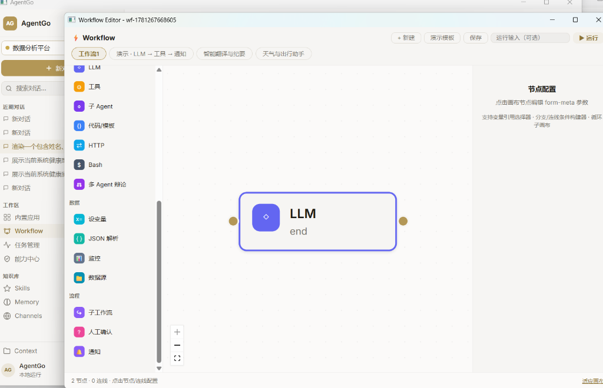
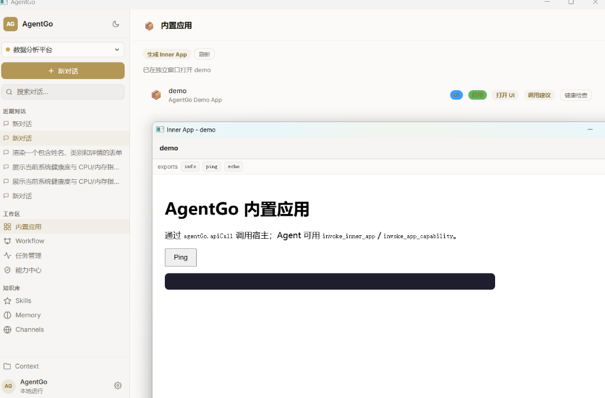

# AgentGo 🚀

[English](#english) | [中文](#中文)

---

## English

AgentGo is a high-performance, lightweight, and modern desktop Agent runtime built using **Go**, **ByteDance's Eino ADK**, and **Wails v3**. **Let agent Go!** It provides a premium visual interface for designing, orchestrating, and executing intelligent agents and workflows directly from your desktop.

### 🖥️ Screenshots

| Visual Workflow Designer (可视化工作流) | Inner App Sandbox (内置应用沙盒) |
| :---: | :---: |
|  |  |

---

### 🌟 Key Features

- **Visual Workflow Designer (Flowgram → Compose)**: Create, edit, and execute complex Directed Acyclic Graph (DAG) workflows. Supports loops, branches, parallel execution, checkpoints, and Human-in-the-Loop (HITL) interruptions.
- **Dynamic CapabilityBus**: A unified capability registry that automatically scans, indexes, and exposes Tools, Skills, Workflows, Inner Apps, and Sub-Agents at runtime.
- **Eino ADK Orchestration**: Leverages ByteDance's Eino framework for structured, type-safe agent graph operations.
- **Memory Console Console**: A premium dashboard featuring a Truth Queue for resolving cognitive conflicts, Graph View for visual 1-hop memory links, and a Context Injection Preview to check exact context utilization before LLM requests.
- **Governance & Policy Pipeline**: Custom governance rules, canvas policies, and budget controls (e.g., token limits, max concurrency) that filter and authorize all incoming capability calls.
- **Inner App Sandbox**: Iteratively build, mock, verify, and run mini-applications (Inner Apps) via natural language commands using the built-in app builder agent.

---

### 🔄 The Capability Lifecycle (Eight Pillars)

AgentGo is engineered around the complete lifecycle of Agentic Capabilities:

1. **Creation (创建)**: Primitives (Tools, Skills, Workflows, Apps) are authored manually or generated on-the-fly using LLMs via natural language prompts.
2. **Registration (注册)**: Assets are registered to the **CapabilityBus** upon discovery, making them instantly available to the runtime without restarting.
3. **Governance (治理)**: Call requests are subjected to the **Policy Engine** (checking concurrency, token limits, and requesting user/HITL approvals for sensitive operations).
4. **Reuse (复用)**: Any Visual Workflow can be compiled and exposed as a standard callable Tool. Sub-agents can call it as an atomic function, enabling complex nested hierarchies.
5. **Scheduling (调度)**: The **App Matrix** acts as an event-driven scheduler. CapabilityBus events (e.g., `workflow.done`) trigger follow-up pipelines via the Matrix Supervisor.
6. **Observation (观测)**: Execution traces, step durations, and prompt tokens are recorded in `governance_audit_log`. Memory contexts are visualized live via the 1-hop Graph View.
7. **Repair (修复)**: Iterative verification loops (`verify_inner_app` + `AutoFixBundle`) auto-detect layout errors or API mismatch issues and heal them using an LLM feedback loop.
8. **Accumulation (积累)**: Stable workflows and apps are saved to the persistent database and indexed into local vector/hybrid memories for future agent discovery and team sharing.

---

### 🤖 AI-Native Unique Selling Points

#### 1. AI-Created Inner Apps (AI 原生桌面应用沙盒)
*   **From Prompt to UI**: AI doesn't just return code; it scaffolds complete, deployable desktop mini-applications (Inner Apps) with operational HTML views and mock bindings.
*   **Deterministic Self-Healing**: Utilizing standard Go sandbox verifications, the system tests the compiled UI code. If errors are found, the `app_builder` sub-agent automatically executes an iterative auto-fix loop until all criteria pass.

#### 2. Editable Workflows-as-a-Tool (AI 创建且可编辑的“工作流工具”)
*   **Natural Language Coding**: Users describe a multi-step logic (e.g. "fetch stock -> summarize -> notify Slack"). The AI compiles this into a standard Eino graph.
*   **Visual Calibration**: Once generated, the Eino graph remains fully **editable** via the popout Wails v3 editor. Users can adjust links, tweak prompts, and toggle nodes visually.
*   **Encapsulation**: The finished workflow registers itself back to the CapabilityBus as a **single tool**. Other LLMs can invoke this entire complex workflow with a single function call!

---

### 🧱 Architectural Layers

AgentGo is organized into 5 clean layers (L0 to L4) to ensure decoupled components and maintainability:

```
L4 Consumer (Wails IPC, Web/SSE Gateway)
  └─ L3 Product Modes (Matrix Orchestration, Admin, Sessions)
      └─ L2 Asset Domains (Tools, Skills, Workflows, Inner Apps)
          └─ L1 Core Systems (Governance, Memory Registry, CapabilityBus)
              └─ L0 Runtime Foundation (DB, Workspace Sandboxing, Logging)
```

- **Rule 1**: High-level packages may only import same-level or lower-level packages.
- **Rule 2**: Asset domain packages (`apps`, `workflow`, `tools`) must never import the orchestrator (`agent`).
- **Rule 3**: The orchestrator (`agent`) must never import the consumer layer (`bridge`).

---

### 📦 Packaging & Builds

AgentGo supports two modes of packaging on Windows:

#### 1. Single-File Executable (`bin/agentgo.exe`)
A fully standalone native executable. All frontend assets compile via Vite and are embedded directly into the Go binary using Go `embed`.
```powershell
# Build the production executable
go build -ldflags="-w -s -H windowsgui" -o bin/agentgo.exe ./cmd/agentgo
```

#### 2. Setup Wizard Installer (`bin/agentgo-amd64-installer.exe`)
A setup wizard compiled using Nullsoft Scriptable Install System (NSIS). Packages the binary and includes WebView2 runtime bootstrapper checks.
```powershell
# Compile the installer using makensis
cd build/windows/nsis
makensis -DARG_WAILS_AMD64_BINARY=C:\Users\wgk\Documents\GitHub\agentgo\bin\agentgo.exe project.nsi
```

---

## 中文

AgentGo 是基于 **Go**、**字节跳动 Eino ADK** 与 **Wails v3** 构建的高性能、轻量级现代桌面智能体运行时。**Let agent Go!** 它提供了一套极具现代设计感的视觉界面，用于直接在桌面上设计、编排和执行智能体与工作流。

### 🖥️ 界面预览

| 可视化工作流设计器 | 内置应用沙盒 (Inner App) |
| :---: | :---: |
|  |  |

---

### 🌟 核心功能

- **可视化工作流设计器 (Flowgram → Compose)**：创建、编辑和运行复杂的有向无环图 (DAG) 工作流。支持循环节点、分支规则、并行执行、Checkpoint 恢复及人工介入 (HITL) 审批。
- **动态能力总线 (CapabilityBus)**：统一的能力资产索引注册表，在应用启动时自动扫描、登记并向系统暴露 Tools、Skills、Workflows、Inner Apps 及子智能体。
- **Eino ADK 编排运行时**：底层深度集成字节跳动 Eino 框架，保证智能体图形化运行时的类型安全与结构化控制。
- **高级记忆控制台**：支持认知冲突消解 of Truth Queue (真相队列)、可视化 1-hop 记忆链的 Graph View (图谱视图) 以及能够在请求 LLM 前查看精确 Token/字节占比的 Injection Preview (注入预览)。
- **治理与策略管道**：自定义 Governance 治理规则、画布策略与并发/预算控制（如 Token 限制、最大并发限制），对所有能力调用进行过滤和授权拦截。
- **Inner App 沙盒**：通过内置的 App Builder 智能体，使用自然语言迭代构建、校验、自动修复并运行应用面板中的微应用 (Inner Apps)。

---

### 🔄 能力生命周期治理（八大支柱）

AgentGo 核心围绕 Agent 能力的完整生命周期开展工作：

1. **创建 (Creation)**：各类能力资产（工具、技能、工作流、应用）既可以由开发者手动编写，也可以由大语言模型通过自然语言 Prompt 动态生成。
2. **注册 (Registration)**：资产创建后，会动态同步并登记在 **CapabilityBus (能力总线)** 上，无需重启应用，运行时即可立即感知并调用。
3. **治理 (Governance)**：每次能力调用必须通过 **策略引擎** 的拦截治理（校验 token 预算、最大并发，针对高风险操作触发 HITL 人工审批）。
4. **复用 (Reuse)**：任何可视化编辑的工作流都可被一键打包并注册为一个**标准 Tool**，供其他子智能体像普通函数一样调用，支持多层嵌套。
5. **调度 (Scheduling)**：通过 **App Matrix (应用矩阵)** 实现事件驱动调度，能力总线上的事件（如 `workflow.done`）可触发 Matrix 自动编排后续任务。
6. **观测 (Observation)**：所有的执行日志、步骤耗时与 prompt 开销均记录于 `governance_audit_log` 审计表中。通过 Graph 视图实时观测记忆上下文的 1-hop 关联。
7. **修复 (Repair)**：提供确定性的校验逻辑 (`verify_inner_app` + `AutoFixBundle`)，如发现 UI 报错或接口异常，由 AI 自动进入自愈修复迭代，直至通过校验。
8. **积累 (积累)**：验证通过的高价值工作流和应用可持久化归档，并通过向量/混合检索录入记忆数据库，供后续智能体搜索和团队积累复用。

---

### 🤖 AI 原生独特优势

#### 1. AI 创建 Inner App (AI 原生桌面应用沙盒)
*   **语言即应用**：用户只需使用口语提出需求，AI 将自动脚手架化 (scaffold) 出包含 UI HTML 骨架、样式 and 模拟交互逻辑的桌面微应用。
*   **确定性自我修复**：集成本地沙盒环境校验。当发现编译报错或组件缺失时，系统会自动将错误日志反馈给 `app_builder` 智能体，触发自动化修复闭环，直到应用 100% 运行正常。

#### 2. 可编辑的 Workflow-as-a-Tool (AI 创建且可编辑的“工作流工具”)
*   **口语化编排**：用户可以用自然语言描述一段复杂的多步逻辑，AI 会自动将其编译成符合 Eino 规范的 DAG 图形化工作流。
*   **可视化微调**：生成的流程不是黑盒，用户可以通过独立的 Wails 窗口打开 VueFlow 画布，直观地编辑节点、微调 Prompt 模版、增删分支。
*   **工具化封装**：设计完成后，该工作流被封装成一个普通的 **Tool** 登记进能力总线。对于主智能体来说，调用这个极其复杂的工作流就像调用一个单体 API 一样简单。

---

### 🧱 架构分层

AgentGo 遵循严格的 5 层架构设计 (L0 至 L4)，以确保模块解耦与代码可维护性：

```
L4 消费层 (Wails IPC、Web/SSE 网关)
  └─ L3 产品模式 (Matrix 编排、Admin 会话状态机)
      └─ L2 资产域 (工具 Tools、技能 Skills、工作流 Workflows、应用 Apps)
          └─ L1 核心系统 (治理规则、记忆注册表、能力总线 CapabilityBus)
              └─ L0 基础运行时 (DB 存储、工作区沙箱、应用日志)
```

- **硬规则 1**：高层包只能 import 同层或更低层的包。
- **硬规则 2**：资产域包 (`apps`、`workflow`、`tools`) 绝对不能 import 编排层 (`agent`)。
- **硬规则 3**：编排层 (`agent`) 绝对不能 import 消费层 (`bridge`)。

---

### 📦 构建与打包

AgentGo 支持以下两种 Windows 端发布包：

#### 1. 单文件绿色版 (`bin/agentgo.exe`)
完全独立的单文件原生可执行程序。前端资源（基于 Vite/TypeScript）在编译后通过 Go `embed` 静态打包进二进制文件。
```powershell
# 编译生产环境可执行文件
go build -ldflags="-w -s -H windowsgui" -o bin/agentgo.exe ./cmd/agentgo
```

#### 2. 安装包向导 (`bin/agentgo-amd64-installer.exe`)
基于 NSIS (`makensis`) 编译的安装向导，包含 WebView2 运行时的静默安装与注册表关联。
```powershell
# 编译安装包
cd build/windows/nsis
makensis -DARG_WAILS_AMD64_BINARY=C:\Users\wgk\Documents\GitHub\agentgo\bin\agentgo.exe project.nsi
```
