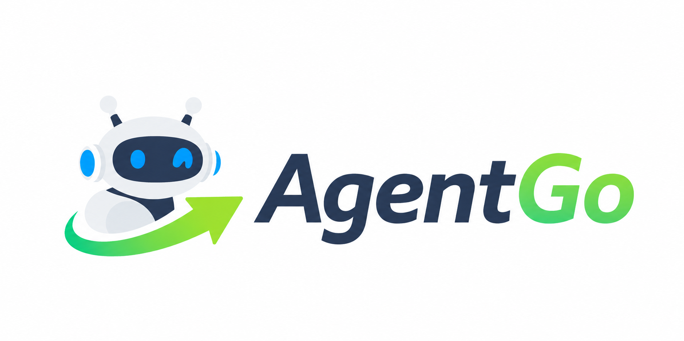

<p align="center">
  
</p>

<h1 align="center">AgentGo</h1>

<p align="center">
  <strong>Let Agent Go!</strong>
  <br />
  <strong>Local-first desktop Agent runtime and client.</strong>
</p>

<p align="center">
  <a href="https://github.com/wk222/AgentGo">
    
  </a>
  <a href="https://github.com/wk222/AgentGo">
    
  </a>
  <a href="https://github.com/wk222/AgentGo">
    
  </a>
  <a href="https://github.com/wk222/AgentGo/stargazers">
    
  </a>
</p>

<p align="center">
  <a href="README.md">English</a> | <a href="README_zh-CN.md">中文说明</a>
</p>

---

## 🚀 Overview

AgentGo is a local-first desktop Agent runtime and client built on **Go**, **ByteDance's Eino ADK**, and **Wails v3**. It provides a clean visual interface for running, inspecting, and reusing agent capabilities: conversations, governed tools, visual workflows, AI-generated Inner Apps, long-term memory, and workspace context live in one local application.

AgentGo's core architecture ensures agent capabilities are **visible, governable, and reusable**. A tool invocation, a workflow node, an Inner App action, and an agent-facing capability all pass through the same runtime: registration, policy, trace, recovery, and accumulation.

### 🖥️ Screenshots

<p align="center">
  
  
</p>

---

## 🌟 Key Features

*   **🎨 Visual Workflow Designer (Flowgram → Compose)**: Orchestrate complex Directed Acyclic Graph (DAG) workflows via a visual canvas. Supports loop nodes, conditional branches, parallel execution, checkpoints, and Human-in-the-Loop (HITL) manual approvals.
*   **🔌 Dynamic CapabilityBus**: A unified runtime registry that makes tools, apps, workflows, skills, and agent capabilities discoverable and governable instantly without restarting the application.
*   **🔗 Eino ADK Orchestration**: Agent, Workflow, memory recall, and tool execution are designed directly upon ByteDance's Eino Graph / Compose patterns instead of one-off hand-rolled chains.
*   **🧠 Advanced Memory Console**: Features a **Truth Queue** for resolving cognitive conflicts, a **Graph View** for visual 1-hop memory links, and a **Context Injection Preview** to review exact token utilization before invoking LLMs.
*   **🛡️ Governed Tool Runtime**: Tools, Bash, database calls, Workflow nodes, and React / ADK paths share the same middleware surface for concurrency, budget guards (e.g., token limits), self-healing, and auditing.
*   **📦 Inner App Sandbox**: Build, mock, verify, and run light mini-applications (Inner Apps) via natural language commands using the built-in app builder agent.
*   **🗂️ Workspace Context Explorer**: A Cursor-like right panel for choosing the workspace root, previewing files safely, adding files to Agent context, and inspecting diffs without pulling unrelated large files.
*   **🧩 Capability Center**: Tools, Skills, Workflows, Apps, Channels, and model-facing actions are surfaced as a single capability inventory instead of scattered implementation details.

---

## 🤖 AI-Native Unique Selling Points

#### 1. AI-Created Inner Apps (AI-Native Desktop App Sandbox)
*   **Prompt to UI**: Describe what you need, and the system scaffolds complete, deployable desktop mini-applications (Inner Apps) with interactive HTML views and mock bindings.
*   **Deterministic Self-Healing**: Using local sandbox testing, the system automatically feeds compilation or layout errors back to the `app_builder` agent for iterative auto-healing.

#### 2. Editable Workflows-as-a-Tool
*   **Natural Language Compilation**: Describe multi-step logic (e.g., "fetch stock -> summarize -> notify Slack") to compile it into an Eino DAG.
*   **Visual Calibration**: Open and adjust nodes, prompts, or branches visually via the built-in canvas.
*   **Atomic Reuse**: Register the completed workflow as a single Tool, letting other agents invoke the entire workflow via a simple function call.

#### 3. Inner App as Tool
*   **Seamless Integration**: Once registered, an Inner App automatically registers its capabilities as an `invoke_inner_app` tool.
*   **Orchestration**: Other agents can programmatically invoke its UI or business logic, facilitating deep multi-agent workflow nested orchestration.

---

## 🧭 Core Concepts

| Concept | Role in AgentGo |
| --- | --- |
| **Session Mode** | Chooses the behavior of the current conversation, such as assistant, App Matrix, admin/planning, or workflow-oriented execution. |
| **Tool** | A governed callable function. It is the lowest-level executable capability and may wrap system actions, workspace actions, app actions, or workflow runs. |
| **Skill** | A reusable knowledge / instruction bundle that teaches the agent how to perform a class of tasks. A Skill can call tools, but is not itself a raw executor. |
| **Workflow** | A visual, inspectable Eino-backed graph for branching, checkpoints, loops, parallelism, review gates, and repeated execution. |
| **Inner App** | A generated or hand-authored mini application. UI apps open in windows; headless apps expose action manifests and can be used like tools. |
| **Memory** | Long-term and episodic context with recall, compaction, truth maintenance, graph links, QA, and feedback. |
| **CapabilityBus** | Runtime registry that makes tools, apps, workflows, skills, and agent capabilities discoverable and governable. |

---

## 🧱 Architectural Layers

AgentGo is organized into 5 clean layers (L0 to L4) to ensure separation of concerns:

```text
L4 Consumer (Wails IPC, desktop windows, Web/SSE Gateway)
  └─ L3 Product Modes (Matrix Orchestration, Admin, Chat Sessions)
      └─ L2 Asset Domains (Tools, Skills, Workflows, Inner Apps, Channels)
          └─ L1 Core Systems (Governance, Memory Registry, CapabilityBus)
              └─ L0 Runtime Foundation (SQLite, Workspace Sandboxing, Logging)
```

---

## 🗺️ Repository Map

```text
cmd/agentgo/          Wails v3 desktop entrypoint
frontend/src/         Vue 3 TSX UI, panels, Wails bridge, mock runtime
internal/agent/       Session orchestration, modes, ADK/Eino integration
internal/bridge/      Wails-facing application service and IPC methods
internal/workflow/    Workflow model, executors, checkpoints, graph/tool bridge
internal/tools/       Built-in tools, dynamic tools, governed invocation
internal/apps/        Inner App scanner, scaffold, verification, runtime metadata
internal/memory/      Memory engine, recall, compaction, truth maintenance
internal/governance/  Policy pipeline, approvals, audit, tool tracking
internal/capability/  Capability registry and event bus
build/                Wails build config, icons, and platform packaging tasks
```

---

## 📚 Documentation

- [Architecture](docs/ARCHITECTURE.md)
- [Internal docs index](docs/README.md)
- [Matrix orchestration](docs/matrix-orchestration.md)
- [PyBot comparison](docs/pybot-layer-map.md)
- [Reproducible build notes](docs/build-reproducible.md)

## 📄 License

See [LICENSE](LICENSE).
